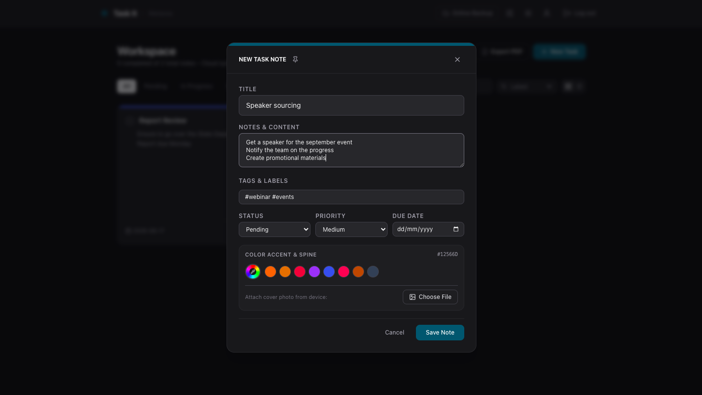
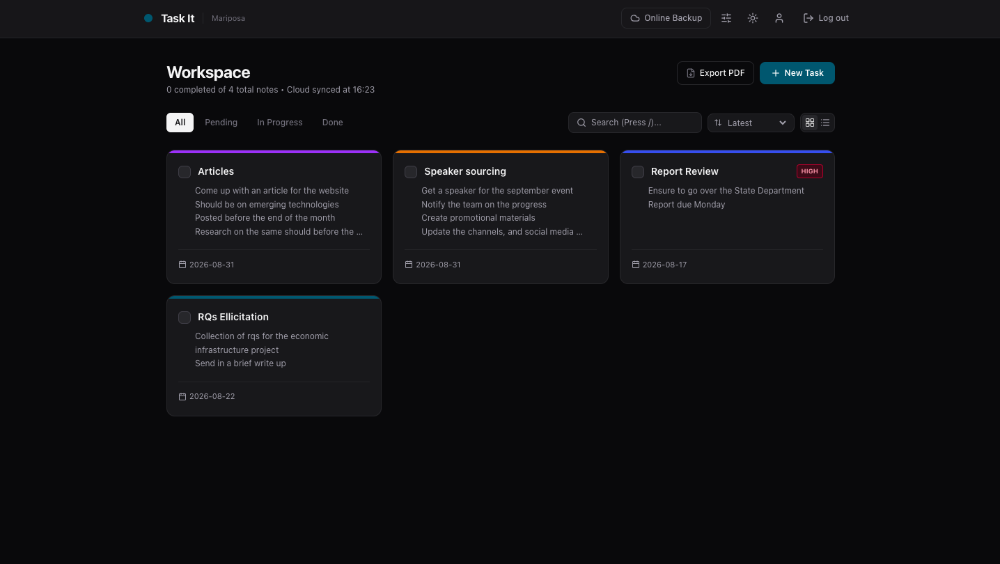
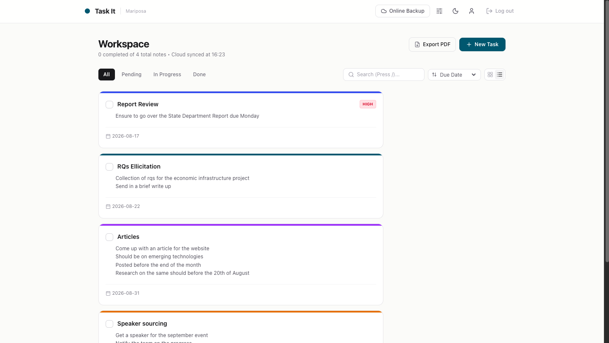
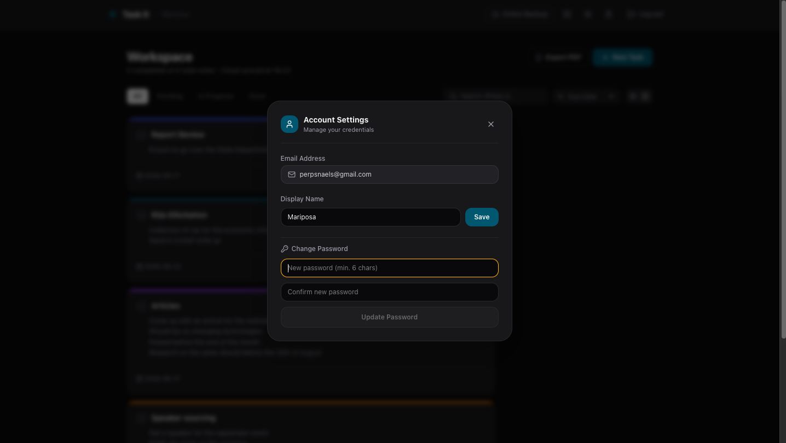
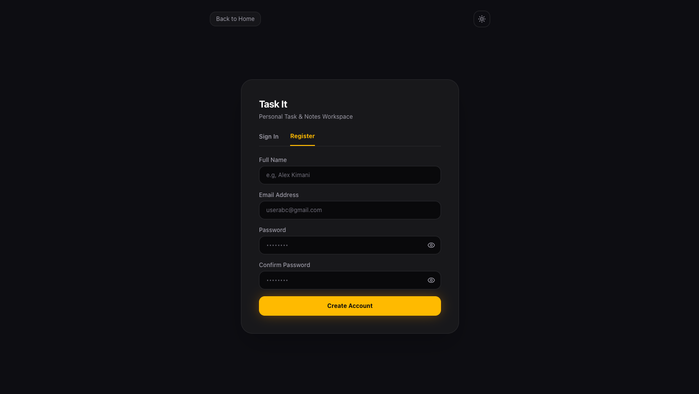
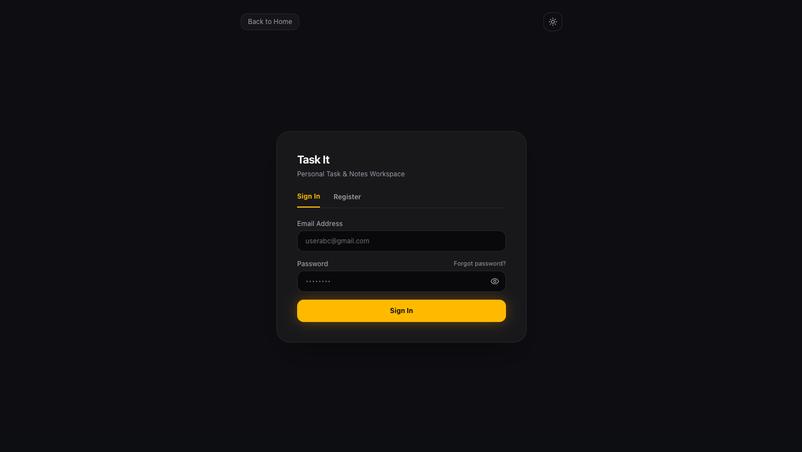
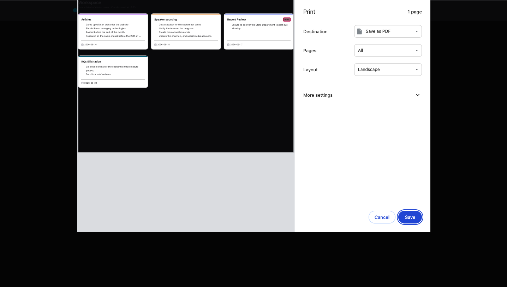

# Task_It 

A focused, lightweight, and modern task management workspace built with React, Vite, Tailwind CSS, and Firebase Firestore. Task_It streamlines daily task organization with PIN-protected notes, custom color theming, online cloud backup, and PDF export.

---

## App Previews

|  ||
| :---: | :---: |
|  |  |
| ||
|  |  |
| ||
|  |  |
|  | |
|  | |

---

## Features

- **Intuitive Task Management**: Create, edit, prioritize, pin, and organize tasks with custom color spines and tags.
- **PIN-Protected Notes**: Lock sensitive notes and to-dos behind a secure 4-digit PIN lock.
- **Custom Color Engine**: Dark/Light mode support with a real-time color wheel picker and preset palettes.
- **Cloud Backup & Sync**: One-click manual online workspace backup to Cloud Firestore with live sync indicators.
- **Print & PDF Export**: Integrated print styling optimized for clean, distraction-free document export.
- **Instant Search & Filter**: Real-time search by keywords, status filters (Pending, In Progress, Done), and custom tag labels.
- **Keyboard Shortcuts**: Built-in shortcuts for fast workflow (`N` for new task, `/` for search bar).
- **Responsive Layout**: Fluid grid and list views across mobile, tablet, and desktop screens.

---

## Tech Stack

- **Frontend**: React, Vite, Tailwind CSS
- **Icons**: Lucide React
- **Authentication & Database**: Firebase Auth & Cloud Firestore
- **Deployment**: Netlify 

---

## Project Structure

```text
task_it/
├── public/
│   ├── screenshots/            # App preview images (screen1.png to screen8.png)
│   ├── _redirects              # Netlify client-side routing redirect rules
│   ├── favicon.png             # Workspace favicon
│   └── hero-character.png      # 3D landing page hero character
├── src/
│   ├── components/
│   │   ├── AccountModal.jsx        # User profile & password management
│   │   ├── Auth.jsx                # Login / Registration with password strength meter
│   │   ├── ColorWheelPicker.jsx    # Custom hex palette engine
│   │   ├── ConfirmDeleteModal.jsx  # Task deletion confirmation dialog
│   │   ├── LandingPage.jsx         # 3D character hero welcome screen
│   │   ├── LockPinModal.jsx        # 4-digit PIN lock interface
│   │   ├── TaskCard.jsx            # Interactive task/note component
│   │   └── TaskModal.jsx           # Task creation & editing interface
│   ├── context/
│   │   ├── AuthContext.jsx         # Firebase authentication state provider
│   │   └── ThemeContext.jsx        # Theme & accent color state provider
│   ├── services/
│   │   ├── firebase.js             # Firebase initialization & configuration
│   │   └── taskService.js          # Firestore CRUD & cloud backup operations
│   ├── App.jsx                     # Core workspace dashboard & route handling
│   ├── index.css                   # Custom keyframes, utility classes & print styles
│   └── main.jsx                    # Application entry point
├── .env.example                    # Environment variable template
├── .gitignore                      # Git ignored files & dependencies
├── firestore.rules                 # Cloud Firestore security rules
├── package.json
└── vite.config.js